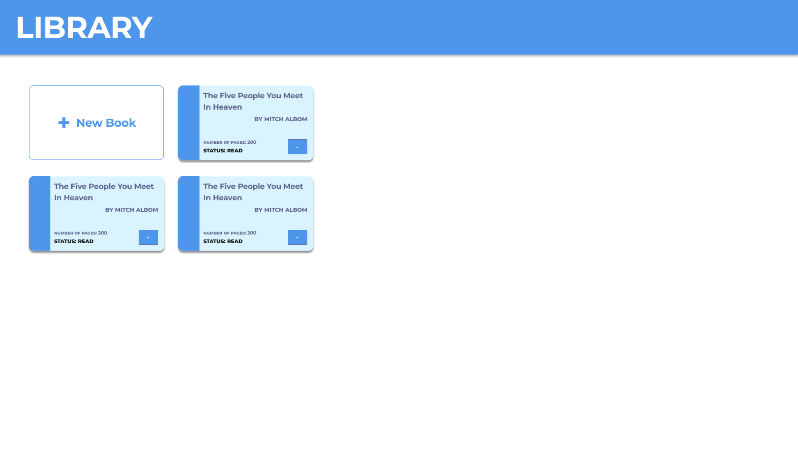
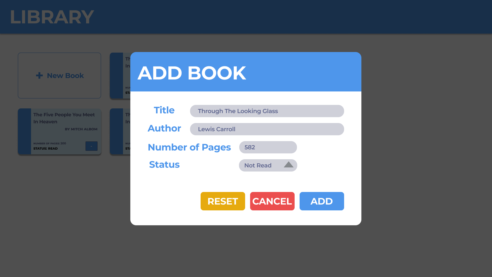

# Library Dashboard Application
Front-end implementation of a dashboard that allows users to add, update, and remove books.

Project based on: https://www.theodinproject.com/lessons/node-path-javascript-library

# Figma Mockup

